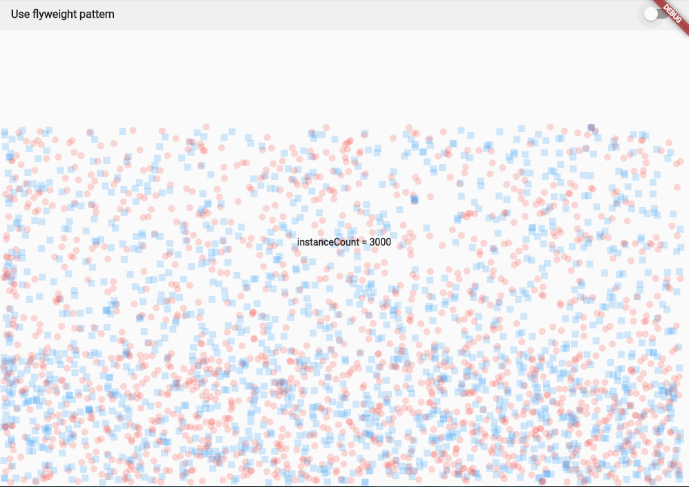
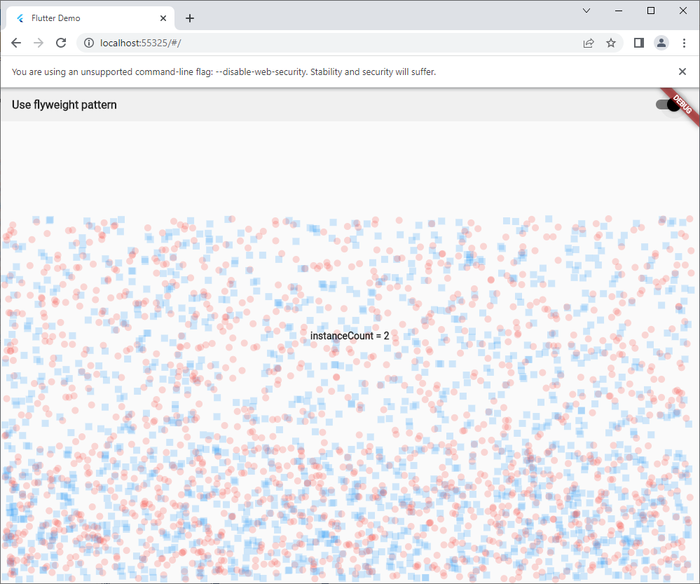

# flyweight_design_pattern

Use sharing to support larg numbers of fine-grained objects efficiently.
# about
When there is huge number of objects shared objects with intrinsic state can be used in multiple contexts simultaneously.

The key concept here is the distinction between intrinsic and extrinsic states. The intrinsic state is invariant(context-independent) and therefore can be shared. The extrinsic state is variant(context-dependent) and therefore can be shared.

## Applicability
The flyweight design pattern should be used only when your program must support a huge number of object which barely fit into available RAM.

This pattern is useful when:
* The objects contain duplicate states which can be extracted and shared between multiple objects.
## Problem
We want to draw our custom background using 
two different geometric shapes - circles and 
squares. To solve a flyweight factory would 
be used which creates a single object per 
shape.
By use flyweight factory its class keeps all
the instances of the needed shapes themselves,
and only returns references to them. 
Hence, only a single instance of a shape 
object per type could be created and reused 
when needed.

##Screenshots

## Getting Started

This project is a starting point for a Flutter application.

A few resources to get you started if this is your first Flutter project:

- [Lab: Write your first Flutter app](https://docs.flutter.dev/get-started/codelab)
- [Cookbook: Useful Flutter samples](https://docs.flutter.dev/cookbook)

For help getting started with Flutter development, view the
[online documentation](https://docs.flutter.dev/), which offers tutorials,
samples, guidance on mobile development, and a full API reference.
